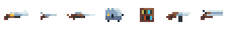

# User Documentation

The user documentation is designed to provide clear and comprehensive guidance on how to navigate and interact with the Machina Mausoleum game.

## Controls
| Key                  | Action             |
| ---------------------| -------------------|
| <kbd>W</kbd>         | Move Up            |
| <kbd>A</kbd>         | Move Left          |
| <kbd>S</kbd>         | Move Down          |
| <kbd>D</kbd>         | Move right         |
| <kbd>LButton</kbd>   | Shoot              |
| <kbd>WheelDown</kbd> | Switch Weapon      |
| <kbd>WheelUp</kbd>   | Switch Weapon      |
| <kbd>E</kbd>         | Equip Weapon Pickup|
| <kbd>E</kbd>         | Pickup Item        |
| <kbd>ESC</kbd>       | Pause / Unpause    |

## Enemies
Enemies are split up into groups based on their attack type:
1. Ranged enemies
2. Melee enemies

### 1. Dwarf [Ranged]
- Health: Average (4)
- Speed: Below Average (1.8)
- Commonly Encountered
- Weapon Types: Shotgun or Pistol

### 2. Buttler [Ranged]
- Health: Below Average (3)
- Speed: Average (2.6)
- Second Most Commonly Encountered
- Weapon Types: Pistol, Shotgun, Library, or Rifle

### 3. Bot [Melee]
- Strongest and Rarest Enemy
- Health: Above Average (7)
- Speed: Above Average (3)
- Attacks by spinning two blades around itself, damaging the player on impact

## Items
Items may be picked up when player collides with them and presses [E] key.

Items are randomly spawned once player succesfully clears a dungeon room. There is a chance that no items spawn after clearing the room.

**Interactable items**
1. **Weapon crate** - Opens to reveal a randomly classified normal weapon.
2. **Special weapon crate** - Opens to reveal a randomly classified special weapon.
3. **Heart** - Refills player health by one heart (2 HP).
4. **Ammo** -  Adds a random amount of ammo to the currently equipped gun.
5. **Elevator Key** -  Adds a key to the player's inventory, allowing them to unlock the elevator.

## Weapons
Both the player and enemies can equip and use the following weapons. Each weapon has different damage characteristics, with enemies dealing reduced damage.

Player may hold 3 weapons at most.

**Weapon types**
1. **Pistol**
2. **Automatica**
3. **Shotgun**
4. **Double barrel shotgun**
5. **Library**
6. **Toaster**

## Dungeon Objects
1. **Elevator** - Takes the player to the next dungeon layer, requiring a key to function. There are both spawn and closed elevators.
2. **Key formation** - Spawns in the key room and includes the key required to operate the elevator.
3. **Obstacles** - Enemies and player have to navigate around them.
